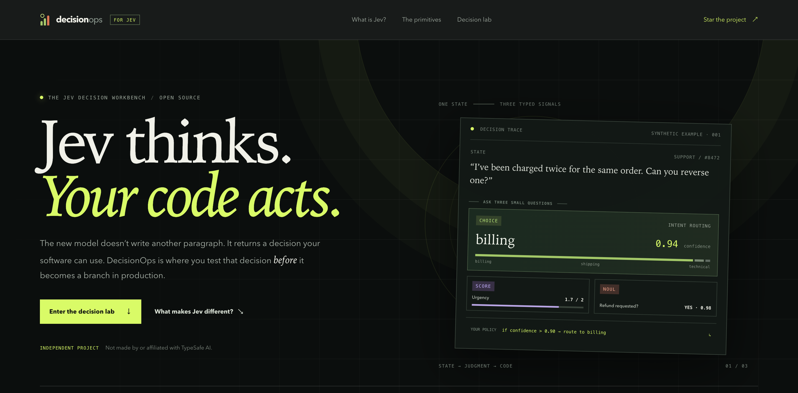
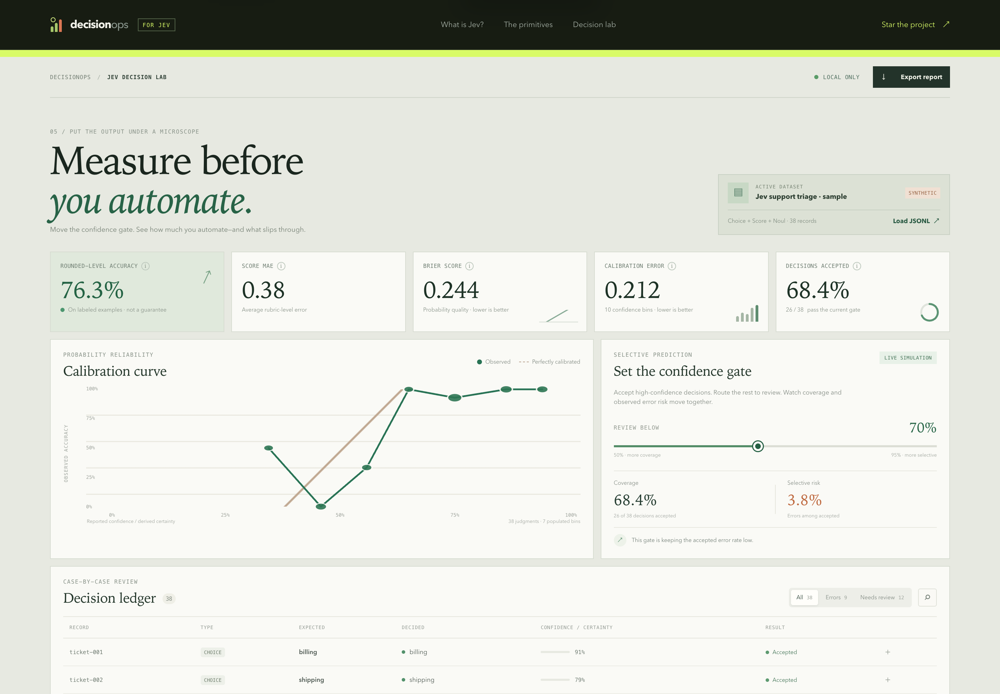

# DecisionOps for Jev — The Open Decision Lab

**Jev thinks. Your code acts. Measure the decision before it becomes a branch.**

Jev AI is TypeSafe AI’s first public **System One** model: instead of generating prose, it answers typed questions with values software can use directly. Its three primitives are **Choice** (pick an option), **Score** (place a state on an ordered rubric), and **Noul** (estimate whether a statement is true).

DecisionOps is an independent, open-source workbench for evaluating Jev-compatible decisions against known outcomes. Inspect confidence, calibration, score error, and the coverage-versus-risk trade-off before your code acts. It is not made by, endorsed by, or affiliated with TypeSafe AI.

The goal is simple: **turn “the model says it’s sure” into “we measured what happens when it says it’s sure.”** Bring saved JSONL outputs from Jev or another structured decision system. No API key, model call, account, telemetry, or upload is needed.

<p align="center">
  
  
</p>
<p align="center"><sub>Homepage and interactive local decision lab. The included dataset and its metrics are synthetic examples.</sub></p>

Learn from [TypeSafe’s official Jev introduction](https://docs.typesafe.ai/introduction), [question primitives](https://docs.typesafe.ai/primitives), and [confidence guide](https://docs.typesafe.ai/confidence).

## Try it

Requires Node.js 20 or newer. There are no runtime dependencies.

```bash
git clone https://github.com/mionax/decisionops.git
cd decisionops
node bin/decisionops.mjs ui
```

Open [http://127.0.0.1:4317](http://127.0.0.1:4317). The included Choice + Score + Noul support-triage dataset is synthetic and clearly labeled in the UI. To evaluate your own records, choose **Load JSONL** or run:

```bash
node bin/decisionops.mjs evaluate path/to/decisions.jsonl --threshold 0.70
node bin/decisionops.mjs evaluate path/to/decisions.jsonl --threshold 0.70 --json report.json
```

The browser workbench reads the selected file locally. It makes no model or third-party requests; the optional report export is created in your browser.

## What you can inspect

- **Rounded-level accuracy** — Choice/Noul match their expected labels; Score is rounded to the nearest rubric level before comparison.
- **Score MAE** — average distance between a predicted Score and its expected rubric level.
- **Brier score** — mean squared error across the predicted class probabilities; lower is better.
- **Calibration** — expected calibration error (ECE) in ten confidence bins, plus a reliability curve. Choice and Score use model-reported `confidence` when present. Jev’s Noul answer is a yes probability, not a separate confidence value; DecisionOps derives a clearly labeled certainty of `max(p, 1-p)` for threshold exploration.
- **Confidence gate** — move the threshold and see how many decisions would be accepted, the resulting coverage, and the errors among accepted decisions (selective risk).
- **Decision ledger** — filter errors and low-confidence cases, inspect each probability distribution, and export a machine-readable report.

## Jev-compatible JSONL format

One JSON object per line. Blank lines and lines beginning with `#` are ignored. Put the known outcome in `label` (or `expected`); put one Jev-shaped typed answer in `result` (or `prediction`). Jev’s `type` may live on the record or in the answer object. This keeps the model output recognizable while adding the expected label needed for evaluation.

### Choice

For a multi-class decision, include a probability for every option. Probabilities may differ from a total of 1 by at most 0.03 to allow rounding; DecisionOps normalizes them. Jev’s model-reported `confidence` is used when included; otherwise DecisionOps uses the selected option’s probability as a derived fallback.

```json
{"id":"ticket-001","label":"billing","result":{"type":"choice","choice":"billing","confidence":0.89,"probabilities":{"billing":0.91,"shipping":0.06,"technical":0.03}}}
```

### Score

Score labels are the expected integer rubric levels, starting at zero. The answer can fall between levels; DecisionOps reports mean absolute error and uses the nearest level for rounded-level accuracy. `legend` is optional and makes the probability breakdown easier to inspect.

```json
{"id":"urgency-001","label":2,"result":{"type":"score","score":1.72,"confidence":0.74,"legend":{"0":"Routine","1":"Time-sensitive","2":"Urgent"},"probabilities":{"0":0.02,"1":0.24,"2":0.74}}}
```

### Noul

Noul asks a yes/no question. Its answer `noul` is the probability of `true`; the label is a JSON boolean or `0`/`1`. Because Noul has no separate confidence field, the workbench derives certainty from the yes probability for the common confidence-gate visualization.

```json
{"id":"review-001","type":"noul","label":true,"result":{"noul":0.92}}
```

A bare numeric result is also accepted for Noul, for example `"result":0.92`. The `binary` type is accepted as an alias.

### What the metrics do—and don’t—mean

The sample data is illustrative, not a Jev benchmark. ECE depends on binning; small or shifted datasets can mislead. Score MAE is measured in rubric levels. Noul certainty is derived, not a model-reported confidence. These metrics are descriptive—not a guarantee of future performance. Use representative holdout data and human review for consequential actions.

## Command line

```text
decisionops evaluate <dataset.jsonl> [--threshold 0.70] [--json <report.json>]
decisionops replay <dataset.jsonl> [--threshold 0.70] [--json <report.json>]
decisionops ui [--port 4317]
decisionops help
```

`replay` is an alias for evaluating recorded decisions; it does not call or rerun a model. The UI server binds to loopback, serves only the app and its bundled sample/code, and rejects cross-origin requests.

## Develop

```bash
npm run dev
npm run check
```

The evaluation core is dependency-free JavaScript in `src/metrics.mjs`; JSONL normalization is in `src/dataset.mjs`. The same modules power the CLI and browser workbench.

## Where it can go

The useful next steps are adapters for common evaluation datasets, model/prompt version comparisons, cost-aware acceptance policies, and uncertainty intervals. A hosted team workflow could be explored later, but local evaluation remains useful on its own and should never require uploading a dataset.

Contributions and concrete dataset-format requests are welcome. See [CONTRIBUTING.md](CONTRIBUTING.md). Licensed under the [MIT License](LICENSE).
